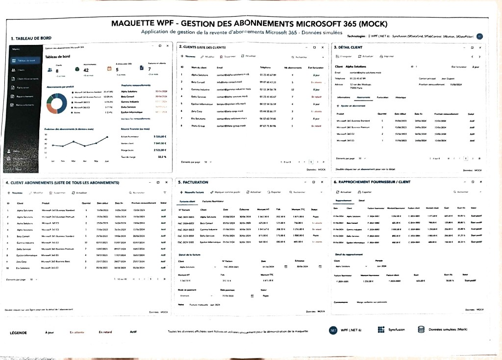
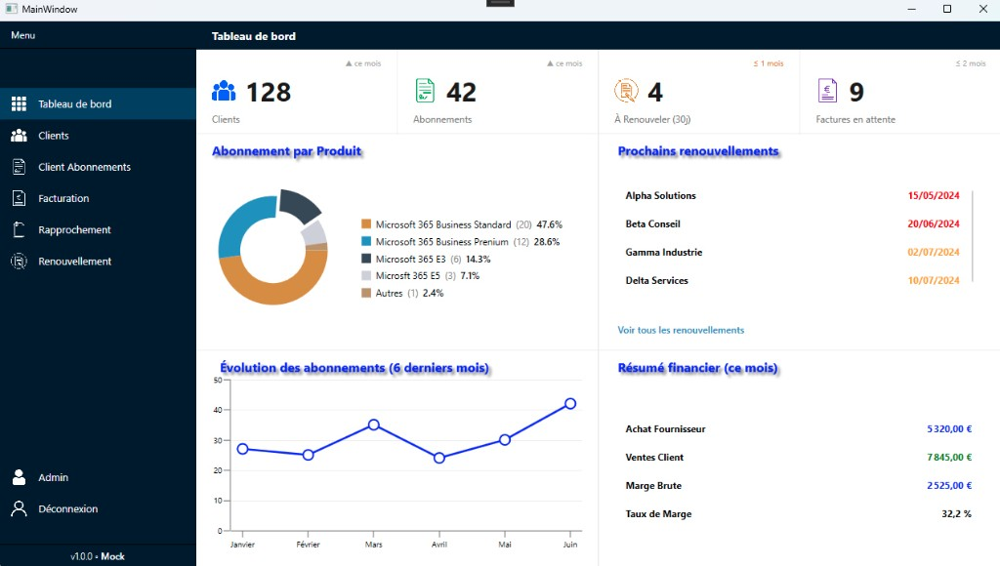

# Fiche récapitulative — Semaine 1 de stage

**Stagiaire :** Matthias Colin  
**Formation :** BTS SIO — option SLAM  
**Établissement :** Lycée Le Castel (Dijon)  
**Entreprise d'accueil :** ID Conseils (SARL)  
**Adresse :** 55 Rue de l'Église, 01570 Feillens  
**Période couverte :** Semaine 1 — du 2 au 6 juin 2026  
**Durée du stage :** 5 semaines (2 juin – 3 juillet 2026)

---

## 1. Contexte de l'entreprise et du stage

ID Conseils est une entreprise de services informatiques qui accompagne ses clients depuis 2004 dans la maintenance et l'évolution de leurs systèmes informatiques (assistance, virtualisation, développement sur mesure, formations).

Dans le cadre de mon stage BTS SIO (option SLAM), je participe au développement d'une **application desktop WPF (.NET 10)** dédiée à la **gestion des abonnements Microsoft 365** : suivi des clients, des licences, de la facturation et du rapprochement fournisseur/client.

Une **maquette mock** fournie en amont définit les **6 écrans** à produire, avec la stack technique suivante : WPF, C#, Syncfusion (`SfDataGrid`, `SfTabControl`, `SfButton`, `SfDatePicker`, `SfChart`).

---

## 2. Périmètre applicatif (maquette)

| # | Écran | Description |
|---|-------|-------------|
| 1 | **Tableau de bord** | KPI, doughnut, courbe sur 6 mois, renouvellements, résumé financier |
| 2 | **Clients** | Liste `SfDataGrid`, CRUD, recherche, état de facturation |
| 3 | **Détail client** | Fiche client + onglets (Informations, Abonnements, Facturation, Historique) |
| 4 | **Client abonnements** | Liste globale de tous les abonnements |
| 5 | **Facturation** | Factures client / fournisseur, détail et dates |
| 6 | **Rapprochement** | Comparaison factures fournisseur vs client, écarts et marge |

> Données simulées (mock) — légende : à jour / en attente / en retard / actif.

---

## 3. Objectifs de la semaine 1

- Découvrir l'environnement de développement de l'entreprise (Visual Studio, dépôt de code, conventions de nommage).
- Prendre en main **WPF** et **C#** sur un projet métier réel.
- Installer et configurer les composants **Syncfusion** (`SfDataGrid`, `SfChart`, doughnut, cards).
- Analyser la maquette des écrans à produire.
- Livrer un **premier écran fonctionnel** : le tableau de bord de l'application.

---

## 4. Travaux réalisés

### 4.1 Maquette de référence

Étude de la maquette **« Gestion des abonnements Microsoft 365 (mock) »**, qui fixe le périmètre fonctionnel et les composants Syncfusion à mobiliser pour l'ensemble du projet.

### 4.2 Tableau de bord (premier écran livré)

Réalisation de l'écran **« Tableau de bord »** (version mock v1.0.0), comprenant :

| Zone | Contenu |
|------|---------|
| **Menu latéral** | Navigation : Tableau de bord, Clients, Abonnements, Facturation, Rapprochement, Renouvellement, Admin |
| **Cartes KPI** | Clients (128), Abonnements (42), À renouveler sous 30 j (4), Factures en attente (9) |
| **Graphique doughnut** | Répartition des abonnements par produit Microsoft 365 |
| **Liste** | Prochains renouvellements avec dates et codes couleur |
| **Graphique courbe** | Évolution des abonnements sur 6 mois |
| **Grille / résumé** | Résumé financier du mois (achats, ventes, marge, taux) |

> Les données affichées sont simulées : l'objectif de cette semaine était de valider l'interface avant la connexion à la couche métier.

### 4.3 Compétences techniques mobilisées

- **UserControls** : découpage modulaire de l'interface (menu, cartes, zones de contenu).
- **Syncfusion** :
  - `SfDataGrid` — affichage tabulaire (résumé financier) ;
  - `SfChart` — graphique en courbes (évolution des abonnements) ;
  - graphique **doughnut** — répartition par produit ;
  - **cards** — indicateurs visuels KPI.
- **Événements WPF** : interactions simples (`MouseOver`, `Click`) sur les éléments de navigation.
- **Ressources XAML** : centralisation des images et styles dans les Resources de l'application.
- **NuGet** : installation et gestion des packages (Syncfusion, dépendances WPF).

---

## 5. Compétences du référentiel BTS SIO mobilisées

| Compétence | Mise en œuvre |
|------------|----------------|
| **B1.4** — Travailler en mode projet | Intégration dans l'équipe, respect du cahier des charges (maquette), livraison du tableau de bord en fin de semaine |
| **B2.1** — Concevoir et développer des composants d'interface | Conception du tableau de bord WPF, UserControls, composants Syncfusion, menu de navigation |
| **B2.2** — Concevoir et développer des composants métier | Première approche du modèle MVVM et préparation de l'affichage des données d'abonnements (mock) |
| **B2.3** — Concevoir et mettre en place une solution logicielle | Participation à l'architecture desktop WPF de l'application métier |

---

## 6. Difficultés rencontrées et solutions

| Difficulté | Solution / apprentissage |
|------------|-------------------------|
| Prise en main de Syncfusion (API, thèmes, data binding) | Documentation officielle, exemples fournis, accompagnement du tuteur |
| Organisation XAML (Resources, UserControls) | Structuration par composants réutilisables |
| Découverte du pattern **MVVM**, différent du **MVC** abordé en cours | Documentation, observation du code existant et mise en pratique progressive |
| Maîtrise d'une technologie desktop encore nouvelle pour moi | Montée en compétence progressive sur WPF, C# et l'écosystème .NET |
| Données mock pour prototyper l'interface | Jeu de données statique v1.0.0 en attendant la couche métier |

Au-delà de ces points d'apprentissage, **aucune difficulté majeure** n'a bloqué l'avancement du projet. Les écarts principaux concernent la découverte d'un environnement (desktop, MVVM, Syncfusion) différent de celui abordé en formation web (PHP, MVC).

---

## 7. Bilan personnel — Semaine 1

Cette première semaine m'a permis de **passer du développement web au développement desktop** (WPF / C#) sur un **cas d'usage concret** en entreprise. J'ai produit un écran complet et professionnel (tableau de bord) en m'appuyant sur des composants Syncfusion.

Je m'attendais à un travail plus orienté logique métier dès le départ ; en réalité, la semaine 1 a surtout porté sur la **partie interface (front-end)** : maquette, navigation, graphiques et indicateurs. C'est cohérent avec la démarche du projet : construire d'abord l'UI sur données simulées, puis brancher la couche métier ensuite.

J'ai consolidé :

- la structuration d'une interface en **UserControls** ;
- la gestion des **événements** et des **ressources** WPF ;
- l'intégration de **packages NuGet** en environnement professionnel ;
- une première approche du pattern **MVVM**.

**Suite :** voir [rapport semaine 2](rapport-semaine-2-idconseils.md) — mise en place du back-end et écran Clients.

---

## 8. Preuves visuelles

**Maquette — écrans à produire :**

**Tableau de bord — semaine 1 (implémenté) :**

---

## 9. Signatures

| | |
|---|---|
| **Stagiaire** | Matthias Colin — Date : ___ / ___ / 2026 |
| **Tuteur entreprise** | Nom : _________________ — Date : ___ / ___ / 2026 |
| **Professeur référent** | Nom : _________________ — Date : ___ / ___ / 2026 |

---

*Portfolio BTS SIO — Matthias Colin — Lycée Le Castel (Dijon)*
