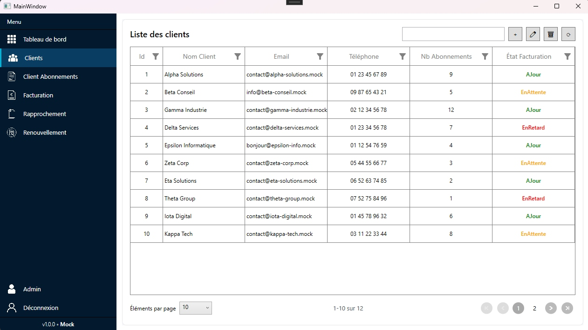
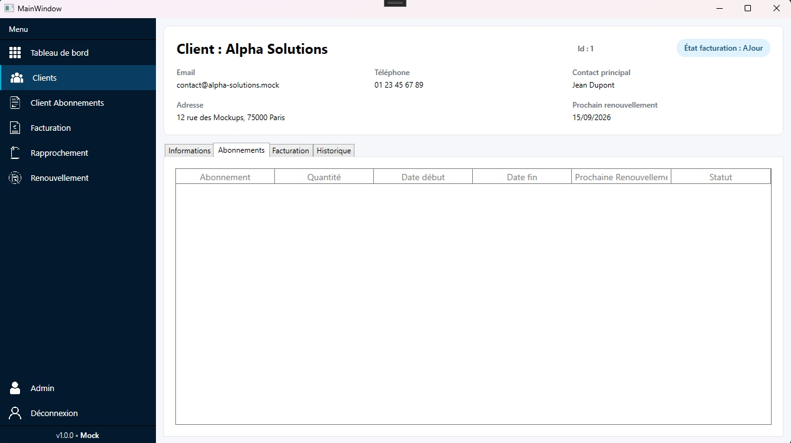

# Fiche récapitulative — Semaine 2 de stage

**Stagiaire :** Matthias Colin  
**Formation :** BTS SIO — option SLAM  
**Établissement :** Lycée Le Castel (Dijon)  
**Entreprise d'accueil :** ID Conseils (SARL)  
**Adresse :** 55 Rue de l'Église, 01570 Feillens  
**Période couverte :** Semaine 2 — du 9 au 13 juin 2026  
**Durée du stage :** 5 semaines (2 juin – 3 juillet 2026)

**Rapport précédent :** [Semaine 1](rapport-semaine-1-idconseils.md)

---

## 1. Rappel du contexte

Poursuite du développement de l'application desktop **WPF (.NET 10)** de gestion des abonnements **Microsoft 365** chez ID Conseils.

À l'issue de la semaine 1, le **tableau de bord** était fonctionnel sur données mock. La semaine 2 marque le passage à la **couche métier (back-end)** et au **deuxième écran** de la maquette : la page **Clients**.

---

## 2. Objectifs de la semaine 2

- Mettre en place la **logique back-end** de l'application (événements, services, DTO).
- Structurer les données selon le pattern **MVVM**.
- Développer l'écran **Clients** (`SfDataGrid`, CRUD, recherche, état de facturation).
- Préparer la navigation vers le détail client avec les **bonnes données**.

---

## 3. Travaux réalisés

### 3.1 Couche back-end — événements, services et DTO

Mise en place des fondations métier de l'application :

| Élément | Rôle |
|---------|------|
| **Événements (back-end)** | Communication entre les couches (ViewModel, services) pour découpler l'interface de la logique |
| **Services** | Centralisation des opérations métier (accès et traitement des données clients) |
| **DTO** (*Data Transfer Objects*) | Objets de transfert structurés entre la couche données et l'interface, sans exposer directement le modèle interne |

Cette organisation prépare le remplacement progressif des données mock par des données réelles, facilite la maintenance du code et anticipe l'intégration d'API dans le futur.

### 3.2 Écran Clients — en cours de finalisation

Développement de la page **Clients** conforme à la maquette (écran n°2) :

| Fonctionnalité | État |
|----------------|------|
| Liste des clients (`SfDataGrid`) | Implémentée |
| Barre d'outils (Nouveau, Modifier, Supprimer, Actualiser) | Implémentée |
| Recherche / filtrage | Implémentée |
| Colonnes métier (ID, nom, e-mail, téléphone, nb abonnements, état facturation) | Implémentées |
| **Redirection vers le détail client** | En cours — liaison des bonnes données à transmettre |
| **Mise en forme finale** | En cours — ajustements visuels et cohérence avec la maquette |

> L'écran est **presque terminé** : il reste à finaliser la redirection avec les données correctes et la mise en forme.

**Écran Clients — semaine 2 :**

**Détail client — semaine 2 :**

### 3.3 Compétences techniques mobilisées

- **Services C#** : encapsulation de la logique métier.
- **DTO** : structuration des échanges de données entre couches et préparation à l'intégration d'API futures.
- **Événements back-end** : gestion des actions utilisateur côté logique.
- **Syncfusion `SfDataGrid`** : affichage tabulaire, colonnes personnalisées, états de facturation (icônes couleur).
- **Navigation inter-écrans** : préparation du passage liste → détail client.

---

## 4. Compétences du référentiel BTS SIO mobilisées

| Compétence | Mise en œuvre |
|------------|----------------|
| **B1.4** — Travailler en mode projet | Enchaînement front-end (S1) → back-end (S2), respect de la maquette et du planning |
| **B2.1** — Concevoir et développer des composants d'interface | Écran Clients : grille Syncfusion, barre d'outils, codes couleur facturation |
| **B2.2** — Concevoir et développer des composants métier | Services, DTO, événements back-end, logique de gestion des clients |
| **B2.3** — Concevoir et mettre en place une solution logicielle | Architecture en couches (UI → ViewModel → Services → DTO) |

---

## 5. Difficultés rencontrées et solutions

| Difficulté | Solution / apprentissage |
|------------|-------------------------|
| Passage du mock à une architecture services / DTO | Suivi du modèle existant, aide du tuteur, lecture du code de référence
| Redirection liste → détail avec les bonnes données | En cours : identification des DTO à transmettre et du mécanisme de navigation |
| Mise en forme alignée sur la maquette | Ajustements XAML et styles en cours de finalisation |

---

## 6. Bilan personnel — Semaine 2

La semaine 2 correspond à ce que j'anticipais après la semaine 1 : un travail plus orienté **back-end** et **logique métier**. La mise en place des **services**, des **DTO** et des **événements** m'a permis de comprendre comment une application WPF professionnelle structure ses données en dehors de l'interface.

L'écran **Clients** est **quasiment terminé**. Les derniers points concernent la **redirection vers le détail client** avec les données appropriées et les **finitions de mise en forme**. Je consolide le pattern **MVVM**, qui devient plus concret maintenant que l'UI et la logique sont reliées.

**Perspectives semaine 3 :**

- Finaliser la page Clients (redirection + mise en forme).
- Poursuivre l'écran **Détail client** (onglets Informations, Abonnements, Facturation, Historique).
- Enrichir les services et connecter davantage de données mock

---

*Portfolio BTS SIO — Matthias Colin — Lycée Le Castel (Dijon)*
