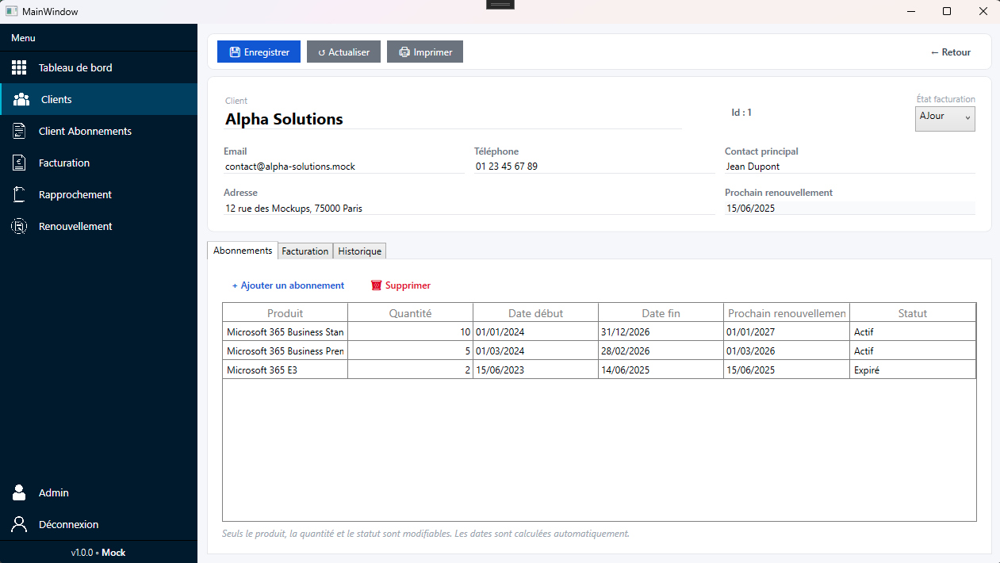
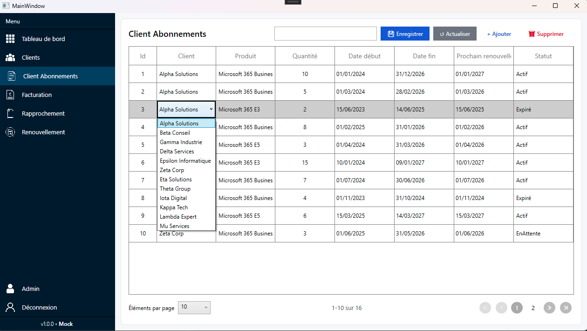
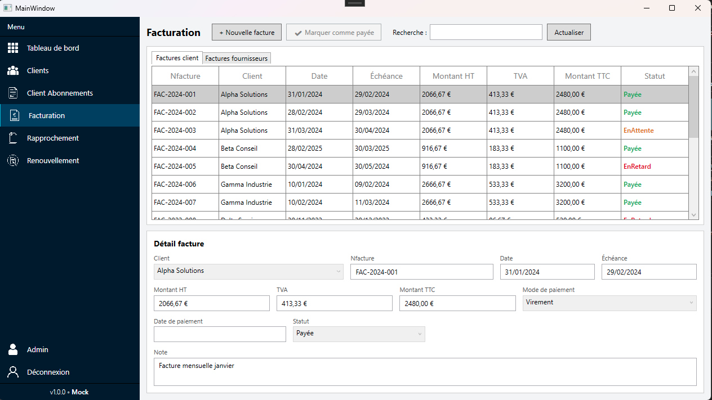

# Fiche récapitulative — Semaine 3 de stage

**Stagiaire :** Matthias Colin  
**Formation :** BTS SIO — option SLAM  
**Établissement :** Lycée Le Castel (Dijon)  
**Entreprise d'accueil :** ID Conseils (SARL)  
**Adresse :** 55 Rue de l'Église, 01570 Feillens  
**Période couverte :** Semaine 3 — du 16 au 20 juin 2026  
**Durée du stage :** 5 semaines (2 juin – 3 juillet 2026)

**Rapport précédent :** [Semaine 2](rapport-semaine-2-idconseils.md)

---

## 1. Rappel du contexte

Poursuite du développement de l'application desktop **WPF (.NET 6)** de gestion des abonnements **Microsoft 365** chez ID Conseils.

Après la mise en place de la couche métier pendant la semaine 2, la semaine 3 a marqué une avancée rapide sur plusieurs écrans clés. Les pages **Détail client**, **Client abonnements** et **Facturation** sont désormais terminées, ce qui a permis d'orienter le travail vers la préparation d'une **API** pour commencer à remplacer les données mock.

---

## 2. Objectifs de la semaine 3

- Terminer la mise en forme des écrans déjà avancés.
- Préparer la création d'une **API** pour remplacer progressivement les données mock.
- Revoir les **DTO** et les **services** pour les adapter à cette nouvelle architecture.
- Recharger les données du **dashboard** avec des informations plus dynamiques et à jour.

---

## 3. Travaux réalisés

### 3.1 Finalisation de l'écran Clients

L'écran **Clients** a été affiné pour se rapprocher davantage de la maquette et améliorer la lisibilité de la liste. Le travail s'est ensuite élargi aux autres écrans métier, désormais terminés :

| Fonctionnalité | État |
|----------------|------|
| Liste des clients (`SfDataGrid`) | Finalisée |
| Barre d'outils (Nouveau, Modifier, Supprimer, Actualiser) | Finalisée |
| Recherche / filtrage | Finalisé |
| Colonnes métier (ID, nom, e-mail, téléphone, nb abonnements, état facturation) | Finalisées |
| Navigation vers le détail client | Finalisée |
| Mise en forme générale | Finalisée |

Cette étape permet de disposer d'un écran plus propre, plus lisible et plus proche du rendu attendu pour la suite du projet.

Dans la continuité, les écrans **Détail client**, **Client abonnements** et **Facturation** ont été finalisés, ce qui valide une avancée rapide sur la partie front-end et permet maintenant de basculer vers l'intégration des données réelles.

### 3.2 Avancement de l'écran Détail client

La page **Détail client** a été finalisée, tout comme les écrans **Client abonnements** et **Facturation**.

Les derniers éléments consolidés concernent :

- l'affichage des informations principales du client ;
- la structure en onglets ;
- la réception des bonnes données depuis la liste ;
- la préparation des sections liées aux abonnements et à la facturation.

Ces écrans servent désormais de base pour centraliser les informations utiles autour d'un client et préparer la consultation des données associées.

**Détail client — semaine 3 :**

**Client abonnements — semaine 3 :**

**Facturation — semaine 3 :**

### 3.3 Renforcement de l'architecture métier

La semaine 3 a aussi permis de faire évoluer la structure métier déjà amorcée pour préparer l'arrivée d'une API :

| Élément | Rôle |
|---------|------|
| **Services** | Gestion centralisée des opérations métier et préparation aux futures sources de données |
| **DTO** | Transmission des données entre les couches sans exposer le modèle interne |
| **Événements back-end** | Réaction aux actions utilisateur et communication entre composants |
| **Navigation entre écrans** | Passage de la liste clients vers la fiche détaillée |

Cette architecture a été remise à neuf pour faciliter les évolutions futures, notamment l'ajout progressif d'une API et la réduction de la dépendance aux données mock.

En parallèle, les données du **dashboard** ont été rechargées pour afficher des informations plus dynamiques et cohérentes avec les écrans métier.

### 3.4 Compétences techniques mobilisées

- **C# / WPF** : consolidation de la logique de l'application desktop.
- **Architecture en couches** : organisation progressive entre interface, services et données.
- **DTO** : structuration des échanges de données entre couches et adaptation à la future API.
- **Syncfusion `SfDataGrid`** : affichage et personnalisation de la liste des clients.
- **Navigation inter-écrans** : passage entre la liste et le détail client.
- **Dashboard** : rechargement des données pour obtenir un affichage plus dynamique.

---

## 4. Compétences du référentiel BTS SIO mobilisées

| Compétence | Mise en œuvre |
|------------|----------------|
| **B1.4** — Travailler en mode projet | Poursuite du projet selon la feuille de route définie avec le tuteur |
| **B2.1** — Concevoir et développer des composants d'interface | Finalisation des écrans Clients, Détail client, Client abonnements et Facturation |
| **B2.2** — Concevoir et développer des composants métier | Refonte des services, DTO et événements pour préparer l'API |
| **B2.3** — Concevoir et mettre en place une solution logicielle | Renforcement de l'architecture en couches de l'application WPF et rechargement du dashboard |

---

## 5. Difficultés rencontrées et solutions

| Difficulté | Solution / apprentissage |
|------------|-------------------------|
| Passer rapidement d'un prototype mock à des écrans finalisés | Enchaînement front-end puis back-end, avec révision de l'architecture |
| Préparer le remplacement des données mock | Création d'une base API et remise à neuf des services / DTO |
| Recharger les données du dashboard | Centralisation des données pour un affichage plus cohérent |

---

## 6. Bilan personnel — Semaine 3

Cette troisième semaine m'a permis de consolider ce qui avait été mis en place la semaine précédente, tout en avançant à un rythme rapide sur plusieurs écrans. La finalisation de **Détail client**, **Client abonnements** et **Facturation** a confirmé la bonne progression du projet, tandis que la suite du travail s'oriente désormais vers une **API** et une base de données mieux structurée.

J'ai également mieux compris l'intérêt de l'organisation en **services**, **DTO** et **événements**, qui rend l'application plus lisible et plus évolutive. La structure actuelle reste orientée vers une séparation claire entre l'interface, la logique métier et les données, avec une préparation progressive à l'arrivée de l'API.

**Perspectives semaine 4 :**

- Commencer l'intégration de l'**API**.
- Rebrancher les écrans sur les nouvelles sources de données.
- Continuer la mise à jour des services et des DTO.

---

*Portfolio BTS SIO — Matthias Colin — Lycée Le Castel (Dijon)*
