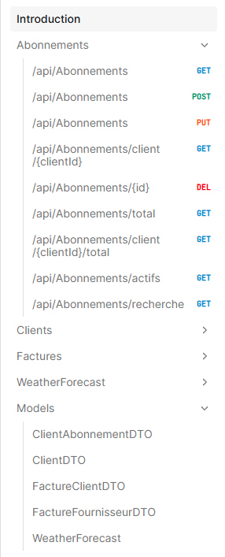
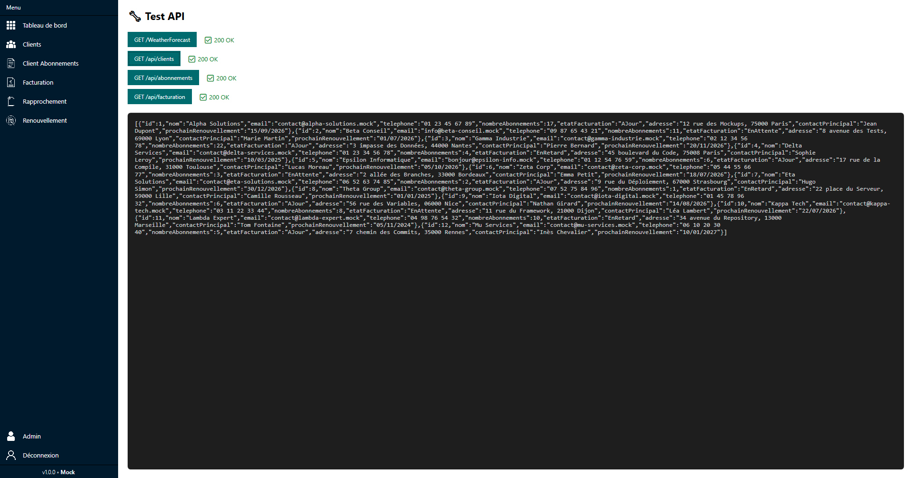
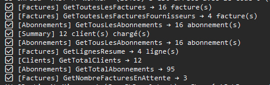

# Fiche récapitulative — Semaine 4 de stage

**Stagiaire :** Matthias Colin  
**Formation :** BTS SIO — option SLAM  
**Établissement :** Lycée Le Castel (Dijon)  
**Entreprise d'accueil :** ID Conseils (SARL)  
**Adresse :** 55 Rue de l'Église, 01570 Feillens  
**Période couverte :** Semaine 4 — du 23 au 27 juin 2026  
**Durée du stage :** 5 semaines (2 juin – 3 juillet 2026)

**Rapport précédent :** [Semaine 3](rapport-semaine-3-idconseils.md)

---

## 1. Rappel du contexte

Poursuite du développement de l'application desktop **WPF (.NET 10)** de gestion des abonnements **Microsoft 365** chez ID Conseils.

Après la mise en place progressive des écrans métier et la préparation de la couche API, la semaine 4 a été consacrée à une étape importante : **remplacer les données mock par une API**, finaliser plusieurs pages de l'application et adapter le service WPF pour consommer les nouvelles requêtes.

---

## 2. Objectifs de la semaine 4

- Créer une **API** permettant de remplacer les données mock codées en dur.
- Finaliser plusieurs pages de l'application pour stabiliser l'interface.
- Finaliser la page **Rapprochement**, page métier dédiée aux **factures fournisseurs**.
- Utiliser la **page Scalar** (admin technique) pour tester les retours API, avec les requêtes **GET, POST, PUT et DELETE**.
- Remplacer les services du **WPF** par des appels aux requêtes API.
- Préparer l'application pour une structure plus propre, plus dynamique et plus proche d'un fonctionnement réel.

---

## 3. Travaux réalisés

### 3.1 Création d'une API pour remplacer les données mock

La priorité de cette semaine a été la mise en place d'une **API** afin de ne plus dépendre uniquement de données simulées présentes directement dans le code.

Cette API sert désormais à :

| Élément | Rôle |
|---------|------|
| **Données mock** | Base de départ utilisée au début du projet pour prototyper rapidement l'application |
| **API** | Nouvelle source de données centralisée, plus proche d'un fonctionnement réel |
| **Requêtes API (GET, POST, PUT, DELETE)** | Lecture, création, mise à jour et suppression des données depuis l'API |
| **Services WPF** | Remplacement progressif de la logique locale par des appels à l'API |

L'objectif était de rendre l'application plus propre côté architecture, mais aussi plus simple à faire évoluer ensuite, car les données ne sont plus dispersées dans plusieurs couches du projet.

### 3.2 Finalisation de plusieurs pages de l'application

En parallèle de l'API, plusieurs pages ont été finalisées ou avancées afin de stabiliser l'interface avant l'intégration complète des données dynamiques.

| Page / zone | État |
|-------------|------|
| Tableau de bord | Ajustements et finitions |
| Clients | Finalisation de l'affichage et des liaisons de données |
| Détail client | Finitions et vérification du comportement |
| Client abonnements | Stabilisation de la page |
| Facturation | Vérification et finitions |
| Rapprochement | Page entière dédiée aux factures fournisseurs (finitions et validation) |
| Admin / Scalar | Tests techniques API et validation des retours (GET, POST, PUT, DELETE) |

Le travail sur ces pages a permis de vérifier que la navigation, les données affichées et les nouveaux appels API restaient cohérents entre les différents écrans.

La page **Rapprochement** est bien traitée comme un écran métier à part entière, centré sur les **factures fournisseurs**.

### 3.3 Utilisation de la page Scalar pour tester les retours API

La **page Scalar** a servi d'outil de test pour vérifier les réponses de l'API avec plusieurs types de requêtes : **GET, POST, PUT et DELETE**.

Ce point était important pour :

- contrôler que les données revenaient bien depuis l'API ;
- vérifier le bon format des réponses ;
- comparer le comportement attendu avec le résultat réel ;
- faciliter les corrections avant de brancher définitivement tous les services WPF.

Cette phase de test a permis d'identifier plus rapidement les ajustements nécessaires et d'éviter de propager des erreurs dans toute l'application.

En parallèle, une première forme de **journalisation** a été mise en place : lorsqu'une requête API est effectuée, un message apparaît dans la console pour confirmer que la requête a bien été chargée. Cela facilite le suivi technique pendant le développement et permet de vérifier rapidement que les appels fonctionnent correctement.

### 3.4 Remplacement des services WPF par des requêtes API

Une autre avancée importante a été la modification des services du projet **WPF** pour qu'ils n'utilisent plus uniquement les données locales, mais qu'ils passent désormais par des **requêtes API**.

Cette évolution apporte plusieurs bénéfices :

- séparation plus nette entre interface et source de données ;
- architecture plus réaliste pour une application métier ;
- simplification des tests de récupération d'informations ;
- préparation à de futures évolutions sans devoir tout réécrire.

Le branchement des services sur l'API constitue une étape clé, car il fait passer le projet d'un mode prototype à une base beaucoup plus exploitable.

### 3.5 Vision avec le professeur principal et la maîtresse de stage

Cette semaine a aussi été marquée par une **vision / réunion de suivi** avec mon **professeur principal** et ma **maîtresse de stage**.

Cet échange a permis de faire le point sur :

- l'avancement global du stage ;
- les compétences déjà mobilisées ;
- la progression vers l'API et la finalisation de l'application ;
- les prochaines étapes à prioriser avant la fin du stage.

Ce temps de suivi a été utile pour valider l'orientation du travail et s'assurer que le projet restait cohérent avec les attentes pédagogiques et professionnelles.

### 3.6 Compétences techniques mobilisées

- **C# / WPF** : adaptation de l'application pour consommer une API.
- **API REST** : création et test de points de récupération de données.
- **Requêtes API (GET, POST, PUT, DELETE)** : lecture, création, mise à jour et suppression des données côté client.
- **Architecture en couches** : séparation entre interface, services et source de données.
- **Page Scalar** : environnement de test pour valider les retours API.
- **Journalisation** : affichage dans la console du chargement des requêtes API.
- **Finitions UI** : stabilisation et cohérence visuelle des différentes pages.

### 3.7 Déroulé concret de la semaine

La semaine 4 a été organisée autour de plusieurs étapes complémentaires qui ont fait avancer le projet de manière plus structurée :

- mise en place de l'API pour centraliser les données utilisées par l'application ;
- tests des endpoints via la page Scalar pour vérifier le comportement des requêtes ;
- observation des retours dans la console grâce à la journalisation ajoutée pendant le développement ;
- adaptation des services WPF pour qu'ils consomment les données de l'API ;
- contrôle visuel et technique des pages déjà développées afin de garder une interface cohérente ;
- échange de suivi avec le professeur principal et la maîtresse de stage pour faire le point sur l'avancement.

Cette organisation a permis de garder une progression claire entre la partie technique, la validation des données et la finalisation des écrans.

---

## 4. Compétences du référentiel BTS SIO mobilisées

| Compétence | Mise en œuvre |
|------------|----------------|
| **B1.4** — Travailler en mode projet | Suivi du planning, échanges avec l'équipe et retour de la vision avec le professeur principal et la maîtresse de stage |
| **B2.1** — Concevoir et développer des composants d'interface | Finitions des pages WPF et vérification de la cohérence visuelle |
| **B2.2** — Concevoir et développer des composants métier | Création de l'API, tests des retours (GET, POST, PUT, DELETE) et adaptation des services |
| **B2.3** — Concevoir et mettre en place une solution logicielle | Remplacement des données mock par une architecture plus réaliste basée sur l'API |

---

## 5. Difficultés rencontrées et solutions

| Difficulté | Solution / apprentissage |
|------------|-------------------------|
| Remplacer les données mock codées en dur | Mise en place d'une API dédiée et migration progressive des appels |
| Vérifier les retours API | Utilisation de la page Scalar pour tester les requêtes GET, POST, PUT et DELETE |
| Adapter les services WPF | Refonte des services pour consommer l'API au lieu des données locales |
| Finaliser plusieurs pages en parallèle | Priorisation des écrans et vérification des liaisons de données |

---

## 6. Bilan personnel — Semaine 4

Cette quatrième semaine a marqué une vraie évolution dans le projet, car elle a permis de passer d'une logique essentiellement basée sur des données mock à une base plus réaliste avec une **API**. J'ai trouvé cette étape plus intéressante techniquement, parce qu'elle relie davantage le WPF à une architecture de type application professionnelle.

Les tests des retours API via la page Scalar (requêtes **GET, POST, PUT et DELETE**) m'ont aidé à mieux comprendre le fonctionnement des échanges entre l'application et la source de données. J'ai aussi avancé sur les finitions des pages, ce qui a renforcé la cohérence générale du projet.

J'ai également confirmé que la page **Rapprochement** est une page complète du logiciel, dédiée aux **factures fournisseurs**, et non une simple zone annexe.

Le fait d'avoir une page Scalar dédiée, ainsi qu'une journalisation simple dans la console, m'a aussi donné un moyen rapide de vérifier ce qui se passait côté API sans perdre de temps à chercher les erreurs dans le code.

La vision avec mon **professeur principal** et ma **maîtresse de stage** m'a également permis de prendre du recul sur le travail effectué et sur les compétences travaillées pendant le stage. Cela m'a aidé à mieux situer mon avancée et à confirmer les priorités pour la suite.

**Perspectives semaine 5 :**

- Finaliser le branchement de l'application sur l'API.
- Continuer la suppression progressive des données mock.
- Vérifier la stabilité des écrans après intégration des requêtes.
- Préparer les dernières captures d'écran pour le compte rendu final.

---

## 7. Preuves visuelles

**Page Scalar — tests des requêtes API (GET, POST, PUT, DELETE) :**

**Page admin — vue de suivi :**

**Journalisation console — chargement des requêtes API :**

---

*Portfolio BTS SIO — Matthias Colin — Lycée Le Castel (Dijon)*