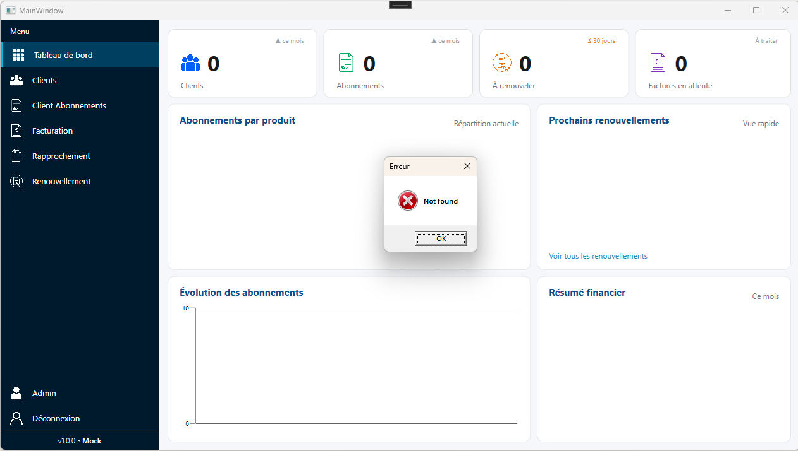
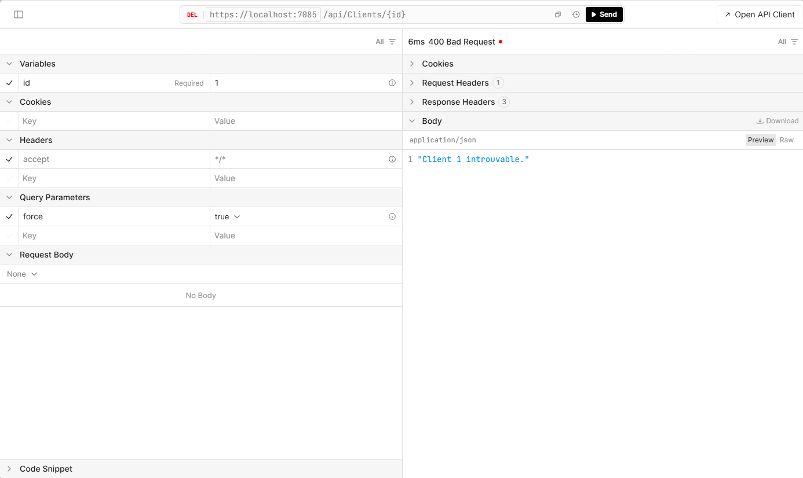
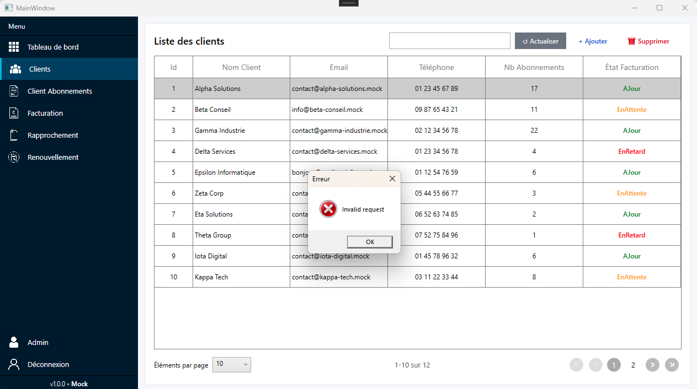

# Fiche récapitulative — Semaine 5 de stage

**Stagiaire :** Matthias Colin  
**Formation :** BTS SIO — option SLAM  
**Établissement :** Lycée Le Castel (Dijon)  
**Entreprise d'accueil :** ID Conseils (SARL)  
**Adresse :** 55 Rue de l'Église, 01570 Feillens  
**Période couverte :** Semaine 5 — du 30 juin au 3 juillet 2026  
**Durée du stage :** 5 semaines (2 juin – 3 juillet 2026)

**Rapport précédent :** [Semaine 4](rapport-semaine-4-idconseils.md)

---

## 1. Rappel du contexte

Poursuite et finalisation du développement de l'application desktop **WPF (.NET 10)** de gestion des abonnements **Microsoft 365** chez ID Conseils.

Après la transition progressive des données mock vers une API réalisée pendant la semaine 4, cette dernière semaine a servi à finaliser complètement l'API, fiabiliser les échanges HTTP et stabiliser l'application avec des méthodes asynchrones pour éviter de bloquer l'interface.

---

## 2. Objectifs de la semaine 5

- Finaliser le branchement complet de l'application sur l'API.
- Supprimer les derniers points restants liés aux données mock.
- Mettre en place une gestion propre des erreurs HTTP, notamment les réponses **BadRequest** et autres codes d'échec.
- Passer certaines méthodes en **async/await** afin de ne pas bloquer le code ni l'interface quand une réponse tarde à arriver.
- Vérifier la stabilité des écrans et corriger les anomalies restantes.
- Finaliser la documentation visuelle (captures) pour le compte rendu de stage.
- Préparer le bilan final technique et personnel.

---

## 3. Travaux réalisés

### 3.1 Finalisation de l'intégration API

L'API a été finalisée et reliée aux différentes parties de l'application. Les derniers services ont été branchés sur les requêtes HTTP réelles afin de remplacer totalement la logique mock.

| Élément | État / détails |
|---------|----------------|
| **EndPoints principaux** | Finalisation des appels de lecture, création, modification et suppression |
| **Services WPF** | Branchement complet sur l'API à la place des données locales |

Les échanges ont été vérifiés pour s'assurer que les données remontent correctement dans l'application et que les mises à jour côté interface suivent bien les réponses du serveur.

### 3.2 Stabilisation des écrans et corrections

Décrire ici les corrections apportées sur les pages (affichage, navigation, données, comportements).

| Page / zone | Correctifs / résultat |
|-------------|------------------------|
| **Écrans métier** | Vérification des données affichées après intégration API |
| **Navigation** | Contrôle du comportement entre les listes, détails et formulaires |

Cette étape a permis de corriger les derniers écarts de comportement et de confirmer que l'application reste cohérente une fois connectée à la source de données réelle.

### 3.3 Tests et validation finale

Présenter ici les tests réalisés (fonctionnels, navigation, cohérence des données, tests API) et les résultats obtenus.

- Tests des requêtes HTTP avec validation des retours serveur.
- Gestion des erreurs **BadRequest** et autres réponses HTTP non valides pour éviter les crashs.
- Passage en **async/await** sur les méthodes concernées afin de ne pas bloquer l'exécution lorsque la réponse tarde.

Ces tests ont confirmé que l'application gère mieux les cas d'échec et réagit de manière plus fluide pendant les appels réseau.

### 3.4 Compétences techniques mobilisées

- **C# / WPF** : finalisation de l'intégration métier et stabilisation de l'application desktop.
- **API REST** : consommation des endpoints, gestion des retours HTTP et des erreurs.
- **Architecture en couches (MVVM / services / DTO)** : séparation propre entre interface, logique métier et échanges réseau.
- **Qualité logicielle (tests, stabilisation, corrections)** : gestion des cas d'erreur, validation des comportements et passage en asynchrone.

---

## 4. Compétences du référentiel BTS SIO mobilisées

| Compétence | Mise en œuvre |
|------------|----------------|
| **B1.4** — Travailler en mode projet | Finalisation du stage, validation des derniers points techniques et préparation du bilan |
| **B2.1** — Concevoir et développer des composants d'interface | Vérification de la stabilité des écrans WPF après branchement API |
| **B2.2** — Concevoir et développer des composants métier | Gestion des requêtes HTTP, des erreurs et passage des méthodes en async |
| **B2.3** — Concevoir et mettre en place une solution logicielle | Stabilisation de l'architecture globale de l'application avec l'API finalisée |

---

## 5. Difficultés rencontrées et solutions

| Difficulté | Solution / apprentissage |
|------------|-------------------------|
| Gestion des erreurs HTTP, notamment les réponses **BadRequest** | Mise en place de contrôles sur les codes retour et traitement explicite des cas d'échec |
| Appels bloquants lors des requêtes réseau | Passage des méthodes en **async/await** pour garder une interface réactive |

Ces corrections ont rendu le comportement de l'application plus robuste et plus proche d'un fonctionnement réel.

---

## 6. Bilan personnel — Semaine 5

Cette dernière semaine m'a permis de terminer l'API et de sécuriser son utilisation dans l'application WPF. J'ai surtout retenu l'importance de gérer correctement les erreurs HTTP, en particulier les cas de type **BadRequest**, pour éviter les comportements imprévus côté interface.

Le passage de certaines méthodes en **async/await** a été un point important : cela permet de ne pas bloquer l'application lorsqu'une requête met du temps à répondre, ce qui améliore directement le confort d'utilisation et la fluidité générale du logiciel.

Sur le plan technique, cette semaine m'a aussi appris à être plus attentif à la fiabilité des échanges entre l'interface et l'API, et à traiter proprement les cas où une donnée n'est pas disponible ou où une requête échoue.

**Clôture du stage :**

- L'application est désormais plus stable et plus réaliste grâce à l'API finalisée.
- Ce stage m'a permis de consolider mes compétences en WPF, C#, API REST et gestion asynchrone.

---

## 7. Preuves visuelles

Les captures ci-dessous illustrent la fin du travail sur l'API, ainsi que la gestion des erreurs et des suppressions côté application.

**Capture 1 — Dashboard avec erreur de récupération des données :**

Cette première capture montre le tableau de bord WPF lorsqu'une requête ne parvient pas à récupérer les données attendues. Le message d'erreur permet de visualiser la gestion du cas où l'API ne répond pas correctement.

**Capture 2 — Suppression du client n°1 sur l'API :**

Cette deuxième capture illustre la suppression du client numéro 1 directement côté API. Elle confirme que l'opération de suppression fonctionne bien au niveau du service.

**Capture 3 — Suppression du client n°1 dans l'application avec erreur :**

Cette dernière capture montre l'application après la suppression du client n°1 dans l'API. Comme le client n'existe plus, l'application renvoie une erreur, ce qui valide le traitement du cas où une donnée demandée n'est plus disponible.

---

*Portfolio BTS SIO — Matthias Colin — Lycée Le Castel (Dijon)*